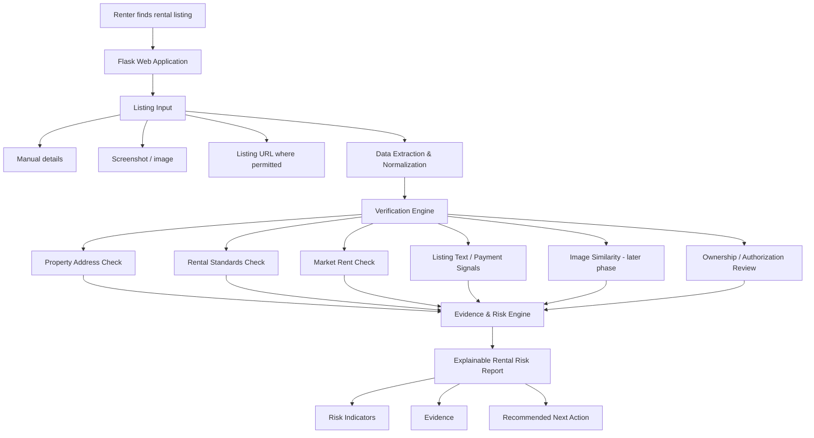
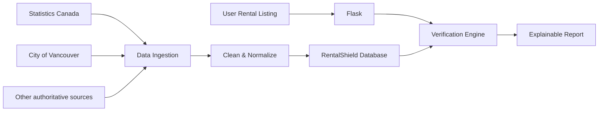

# RentalShield — Build Session 1 Evidence & Build Plan

> **Found a rental? Check it before you pay.**

**Project:** RentalShield  
**Domain:** Renter safety / fraud-risk assessment in Canada  
**Initial geography:** Vancouver, British Columbia  
**Build stack:** Python + Flask + database + public/open data  
**Document purpose:** Build Session 1 evidence, data foundation, and implementation scope

---

## 1. What RentalShield Is

RentalShield is a renter-focused verification and risk-assessment tool that helps a person evaluate an online rental listing **before sending money or sensitive information**.

It is not another rental marketplace.

It is not intended to prove that a landlord is a scammer.

Instead, RentalShield acts as a **verification layer above existing rental platforms** and combines independent evidence into one explainable safety report.

The central product question is:

> **“I found a rental. What evidence should I check before I trust this listing enough to pay?”**

RentalShield turns scattered checks into one workflow.

---

# 2. Problem Evidence

## 2.1 What problem are we solving?

Renters may discover properties through Facebook Marketplace, Craigslist, Kijiji, social-media groups, and rental platforms.

The listing itself may look legitimate while important facts remain difficult to verify.

A renter may need to determine:

- Does the address correspond to a real property?
- Is the advertised rent unusually low?
- Is the property associated with public rental-standard issues?
- Are the photos or description reused elsewhere?
- Is the advertiser the owner or an authorized manager?
- Is the renter being pressured to pay before viewing?
- Are unusual payment instructions being used?
- Is personal or financial information being requested too early?
- Are the address, unit details, landlord information, and lease information consistent?

### The deeper problem

The problem is **fragmented evidence**.

The information needed to evaluate a rental is spread across:

```text
Government data
      +
Rental-market statistics
      +
The rental listing itself
      +
Public scam guidance
      +
Renter observations
      ↓
No single renter-focused verification workflow
```

RentalShield is designed to connect these evidence sources.

---

# 3. Government and Law-Enforcement Evidence

## 3.1 B.C. RCMP rental-scam guidance

B.C. RCMP identifies rental-scam warning patterns including:

- unusually low rent
- requests for deposits before viewing
- refusal to meet
- duplicate posts
- mismatched photos
- missing landlord names on rental documents
- requests for money or financial information

These warning patterns are important because they can become **explainable rules/signals** in RentalShield.

Source: [B.C. RCMP — Rental Scams](https://rcmp.ca/en/bc/safety-tips/frauds-and-scams/rental-scams)

---

## 3.2 Richmond RCMP reported cases

Richmond RCMP reported **five rental-deposit fraud reports since July 2025**, with individual losses ranging from **$400 to $2,600**.

The reported pattern involved victims finding online rental advertisements, contacting an alleged owner, sending a deposit by e-transfer, and later discovering that the property was unavailable.

Source: [Richmond RCMP — Rental Deposit Scams](https://rcmp.ca/en/bc/richmond/news/2025/08/richmond-rcmp-warns-public-about-rental-deposit-scams)

### Why this matters to RentalShield

This gives us real-world evidence that:

```text
Online rental advertisement
          ↓
Contact alleged landlord
          ↓
Deposit requested
          ↓
Money transferred
          ↓
Property unavailable
```

RentalShield is designed to introduce a **verification step before the payment stage**.

---

# 4. Public-Forum Evidence

Public Vancouver housing discussions show renters encountering situations similar to the warning patterns identified by law enforcement.

Examples documented during project research include:

### Deposit requested before viewing

A Vancouver renter described a landlord suggesting payment of a half-month security deposit to secure an apartment before an in-person viewing.

### Pressure to e-transfer

Another discussion described pressure to e-transfer half a month's rent to secure the rental.

### Name/title inconsistency

Another discussion raised a concern where the name on the lease did not match the property title.

### Important limitation

These public posts are **not treated as proof that a named person is fraudulent**.

They are qualitative evidence of renter pain points and help identify the types of signals that RentalShield should help users verify.

---

# 5. Existing Solutions and the Gap

Government agencies, rental platforms, and public safety organizations already provide useful information and safety guidance.

Therefore, RentalShield does **not** claim that rental safety information does not exist.

The gap is **fragmentation**.

A renter may have to perform several independent checks:

```text
Check rent
   ↓
Search address
   ↓
Search property records
   ↓
Inspect landlord information
   ↓
Check photos
   ↓
Read scam guidance
   ↓
Evaluate payment request
   ↓
Make a decision
```

RentalShield proposes:

```text
Rental listing
      ↓
   RentalShield
      ↓
Independent evidence checks
      ↓
Explainable risk indicators
      ↓
Recommended next action
```

---

# 6. Data Evidence

RentalShield does not depend on one dataset.

Each source answers a **different question**.

| Data source | What it provides | RentalShield use | Important limitation |
|---|---|---|---|
| Statistics Canada — Table 46-10-0092-01 | Quarterly asking/paid rents by geography, bedrooms and unit type | Market benchmark and rent-anomaly analysis | Quarterly; experimental estimates may be revised |
| City of Vancouver — Property Addresses | Official property/address information | Address existence and normalization check | Not a complete list of all addresses; weekly extract |
| City of Vancouver — Rental Standards: Current Issues | Licensed rental properties with 5+ units having unresolved by-law issues | Public-record property warning | Limited to the dataset's coverage |
| User-submitted listing | Rent, address, photos, description, landlord/manager information | Analyze the actual rental being evaluated | Requires privacy and data-minimization controls |
| Official scam guidance | Known warning patterns and reported cases | Define explainable risk signals | Not a labelled machine-learning dataset |

---

# 7. Dataset 1 — City of Vancouver Property Addresses

### Question answered

> **“Does this submitted address appear in Vancouver's official public property-address data?”**

Source: [City of Vancouver — Property Addresses](https://opendata.vancouver.ca/explore/dataset/property-addresses/)

### How RentalShield uses it

```text
User submits address
        ↓
Address normalization
        ↓
Search Property Addresses dataset
        ↓
Match found?
   ↙           ↘
 YES           NO
  ↓             ↓
Address      Could not
appears      verify from
in source    this dataset
```

### Important limitation

A match means the address appears in the public dataset.

It does **not** prove:

- ownership
- landlord identity
- authorization to rent
- legitimacy of the listing

The dataset is also not a complete list of every address and has a weekly extract.

Therefore, RentalShield should use language such as:

> **“Address found in the available public property dataset.”**

and not:

> “This rental is legitimate.”

---

# 8. Dataset 2 — Vancouver Rental Standards: Current Issues

### Question answered

> **“Does this property have a public rental-standard/by-law issue recorded in this dataset?”**

Source: [City of Vancouver — Rental Standards: Current Issues](https://opendata.vancouver.ca/explore/dataset/rental-standards-current-issues/)

The dataset covers licensed rental properties with 5+ units that have current/unresolved by-law issues within the dataset's scope.

The Open Data extract is updated daily, with a source-to-publication delay.

### RentalShield use

```text
Submitted address
       ↓
Address matching
       ↓
Rental Standards dataset
       ↓
Match?
  ↙       ↘
YES       NO
 ↓         ↓
Show      No issue found
public    in this dataset
record
warning
```

### Important interpretation

A property issue is **not proof of a rental scam**.

RentalShield should say:

> “A public property record requires review.”

It should not say:

> “This property is a scam.”

---

# 9. Dataset 3 — Statistics Canada Quarterly Rent Statistics

### Question answered

> **“Is the advertised rent unusual compared with an appropriate market benchmark?”**

Source: [Statistics Canada — Table 46-10-0092-01](https://www150.statcan.gc.ca/t1/tbl1/en/tv.action?pid=4610009201)

The dataset provides quarterly asking and paid rent statistics for selected Canadian metropolitan areas by rental unit characteristics.

### Example

Suppose:

```text
Listing rent       = $1,800
Market benchmark   = $2,900
```

Rent anomaly:

```text
($2,900 - $1,800) / $2,900 × 100
≈ 38%
```

RentalShield can report:

> **“The advertised rent is approximately 38% below the available market benchmark.”**

This is a **warning signal**, not a probability of fraud.

---

# 10. The Most Important Data Relationship

The datasets do different jobs.

They should not be treated as one combined dataset containing the complete truth about a property.

```text
                 RENTAL LISTING
                      │
        ┌─────────────┼─────────────┐
        │             │             │
      Address         Rent        Listing
        │             │           content
        ↓             ↓             ↓
 Property         Statistics    NLP / Image
 Addresses         Canada        Analysis
        │
        ↓
 Rental Standards
        │
        ↓
 Public-property
 warning
```

The final decision combines the **evidence**, not the datasets themselves.

---

# 11. Important Missing Layer: Ownership / Authorization

One of the key limitations identified during research is:

> **Address existence does not prove that the person advertising the rental owns the property or is authorized to rent it.**

Therefore, ownership/authorization should be treated as a separate verification layer.

The first version should not falsely claim automatic ownership verification unless an authoritative, legally usable data source is available.

Instead:

```text
Address verification
        +
Landlord / manager information
        +
Available authoritative records
        +
User-provided lease information
        ↓
Ownership / authorization
confidence level
```

Possible output:

- **Verified from available evidence**
- **Partially verified**
- **Could not verify**
- **Additional verification recommended**

This is safer and more defensible than claiming a binary “owner verified” result without sufficient evidence.

---

# 12. What We Are Taking Into Build Session 2

Build Session 2 is not about building the entire finished product.

The goal is to take the **evidence foundation** and turn it into a working technical MVP foundation.

## Build Session 2 scope

### 1. Flask application

Create the RentalShield web application using Flask.

```text
Browser
   ↓
Flask application
   ↓
RentalShield backend
```

### 2. Database foundation

Create database tables for the public data and rental checks.

Initial logical structure:

```text
PROPERTY
---------
property_id
address
postal_code
source
last_updated


RENTAL_STANDARD_ISSUE
---------------------
issue_id
property/address
issue_type
issue_status
source
last_updated


RENT_BENCHMARK
--------------
benchmark_id
geography
bedrooms
unit_type
quarter
avg_asking_rent
avg_paid_rent
source


LISTING_CHECK
-------------
listing_id
address
rent
bedrooms
landlord_name
risk_score
risk_category
checked_at
```

The exact physical schema can be refined during implementation.

---

# 13. Build Session 2 — First Functional Checks

The first working version should focus on three strong evidence checks.

## Check 1 — Address verification

```text
User enters address
        ↓
Normalize address
        ↓
Search local property-address data
        ↓
Return evidence
```

Example:

> Address found in Vancouver public property-address data.

---

## Check 2 — Rental-standard check

```text
Submitted address
        ↓
Match against rental-standard data
        ↓
Issue found?
        ↓
Evidence + explanation
```

Example:

> Public rental-standard record found. Review recommended.

---

## Check 3 — Rent anomaly

```text
User enters:
Vancouver
2 bedrooms
$1,800

        ↓

Find appropriate benchmark

        ↓

Compare listing rent with benchmark

        ↓

Calculate anomaly

        ↓

Explain result
```

Example:

> Advertised rent is approximately 38% below the available benchmark.

---

# 14. Evidence-Based Risk Engine

The MVP should use an **explainable rule/evidence model**, not a black-box AI score.

Illustrative signals:

| Signal | Illustrative contribution |
|---|---:|
| Deposit requested before viewing | +25 |
| Strong rent anomaly | +20 |
| Possible duplicate image | +25 |
| Urgency/pressure language | +10 |
| Property information inconsistency | +15 |
| Public property warning | +10 |
| Address verified | -10 |

These are **design examples, not validated probabilities**.

The system must not claim:

> “There is a 70% probability this is a scam.”

unless that probability has been scientifically validated.

Instead, use:

> **High-risk indicators detected — verify before paying.**

---

# 15. RentalShield Technical Architecture



---

# 16. Data Pipeline

Government datasets should not necessarily be downloaded from scratch every time a user checks a rental.

Instead:



This gives the application a local evidence layer that can be queried quickly.

---

# 17. Data Refresh Strategy

Different sources update at different frequencies.

| Source | Refresh characteristic | RentalShield strategy |
|---|---|---|
| Vancouver Property Addresses | Weekly extract | Periodic ingestion |
| Vancouver Rental Standards | Daily extract | Frequent ingestion |
| Statistics Canada rent statistics | Quarterly | Quarterly refresh |
| User listing | At time of check | Process during request |

The database should store a `last_updated` value so the report can communicate the freshness of its evidence.

---

# 18. Why Flask?

RentalShield is being developed as a **web application**, not a notebook-only analysis.

Flask provides the backend/API layer for:

- receiving renter input
- processing listing information
- querying the database
- running verification logic
- calculating explainable risk indicators
- returning results to the web interface

Target architecture:

```text
                Browser
                   │
                   ▼
              Flask App
                   │
        ┌──────────┼──────────┐
        ▼          ▼          ▼
    Database    Analysis    Risk Engine
        │          │          │
        └──────────┼──────────┘
                   ▼
          Explainable Report
```

---

# 19. What Is NOT Being Built Yet

To keep Build Session 2 technically realistic, these should not be treated as mandatory MVP components:

- Direct APIs for every rental marketplace
- Automatic accusation of landlords
- Guaranteed ownership verification
- A scientifically validated fraud probability
- A full machine-learning scam classifier
- A nationwide Canadian deployment
- A complete rental marketplace

These can become future phases after the evidence foundation is validated.

---

# 20. Future Intelligence Layer

After the evidence-based MVP works, RentalShield can add:

### OCR

Extract rental details from screenshots.

```text
Screenshot
    ↓
OCR
    ↓
Address / rent / bedrooms / landlord / text
```

### NLP

Detect language patterns such as:

- “send deposit now”
- “many people interested”
- “pay before viewing”
- urgency
- payment pressure
- avoidance of viewing

### Image similarity

Identify possible reuse of rental images where technically and legally permitted.

### ML validation

Once a sufficiently reviewed dataset exists:

```text
Historical reviewed cases
          ↓
Feature engineering
          ↓
Model training
          ↓
Validation
          ↓
Calibration
          ↓
Careful deployment
```

The ML model should come **after** the evidence foundation, not before it.

---

# 21. Example RentalShield Report

### Listing submitted

```text
Address: Vancouver, BC
Bedrooms: 2
Advertised rent: $1,800
Deposit requested: Before viewing
```

### Evidence

| Check | Result |
|---|---|
| Address | Found in public address dataset |
| Market rent | Approximately 38% below benchmark |
| Rental standards | Public record requires review |
| Deposit request | Before viewing — warning signal |
| Listing language | Urgency/payment-pressure signal |
| Ownership | Could not independently verify from available public data |

### Final result

> 🔴 **HIGH-RISK INDICATORS — VERIFY BEFORE PAYING**

### Recommended next action

> Do not send money solely because the listing appears legitimate. Complete the recommended verification steps first.

---

# 22. Responsible AI and Safety

RentalShield is a **decision-support tool**.

It does not make legal, police, or definitive fraud determinations.

Important principles:

1. A legitimate property can have warning signals.
2. A scam can avoid obvious warning signals.
3. Public datasets can be incomplete or delayed.
4. Address existence does not prove ownership.
5. Low rent does not prove fraud.
6. Reddit posts are qualitative evidence.
7. Personal information should be minimized.
8. RentalShield should not publicly accuse identifiable landlords or property managers.
9. Every risk indicator should have an evidence/explanation trail.

---

# 23. Build Session 2 Success Criteria

By the end of Build Session 2, the project should demonstrate:

- [ ] Flask application running locally
- [ ] Database created
- [ ] Public property-address data loaded
- [ ] Rental-standard data loaded
- [ ] Statistics Canada benchmark data prepared
- [ ] Address normalization/check implemented
- [ ] Rental-standard matching implemented
- [ ] Rent-anomaly calculation implemented
- [ ] Evidence stored or traceable to source
- [ ] Explainable result returned to the user
- [ ] Basic RentalShield web interface working

The goal is a **working evidence-based foundation**, not a polished final product.

---

# 24. What We Can Demonstrate to the Panel

The Build Session 2 demonstration should tell one clear story:

```text
REAL PROBLEM
     ↓
Government / public evidence
     ↓
Real datasets
     ↓
Data ingestion
     ↓
Flask application
     ↓
Verification checks
     ↓
Evidence-based risk indicators
     ↓
Actionable renter guidance
```

### Demonstration scenario

A renter enters a Vancouver rental:

```text
2-bedroom apartment
Advertised rent: $1,800
Address: [sample address]
Deposit requested before viewing
```

RentalShield then demonstrates:

1. Address lookup
2. Rental-standard lookup
3. Market benchmark comparison
4. Risk-signal detection
5. Evidence display
6. Explainable final recommendation

This gives the panel a concrete connection between:

**problem → evidence → data → engineering → impact**

---

# 25. Primary Sources

- [B.C. RCMP — Rental Scams](https://rcmp.ca/en/bc/safety-tips/frauds-and-scams/rental-scams)
- [Richmond RCMP — Rental Deposit Scams](https://rcmp.ca/en/bc/richmond/news/2025/08/richmond-rcmp-warns-public-about-rental-deposit-scams)
- [Statistics Canada — Table 46-10-0092-01](https://www150.statcan.gc.ca/t1/tbl1/en/tv.action?pid=4610009201)
- [City of Vancouver — Property Addresses](https://opendata.vancouver.ca/explore/dataset/property-addresses/)
- [City of Vancouver — Rental Standards: Current Issues](https://opendata.vancouver.ca/explore/dataset/rental-standards-current-issues/)
- [Competition Bureau — Fraud and Scams](https://competition-bureau.canada.ca/en/fraud-and-scams/tips-and-advice/how-report-fraud-and-scams-canada)

---

## Final Build Direction

**RentalShield = Flask web application + local evidence database + explainable verification engine.**

The first engineering milestone is not “detect scams with AI.”

It is:

> **Build a trustworthy evidence layer that can check a rental listing against independent sources and clearly explain what was found, what could not be verified, and what the renter should do next.**
